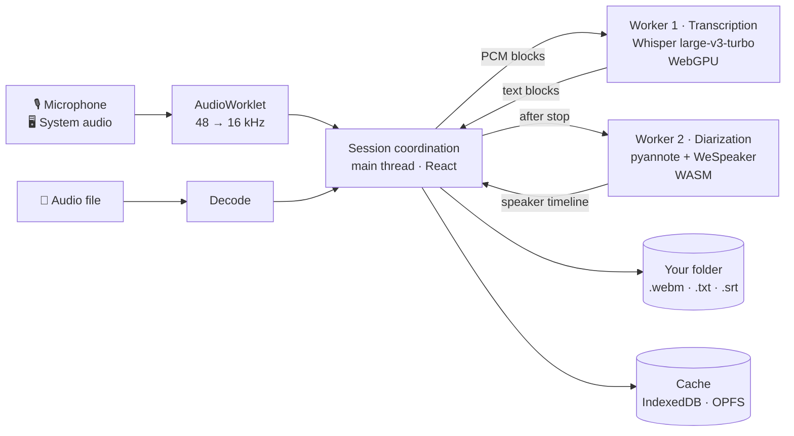

# localRec

**Transcription that never leaves your device.**

localRec is a free, open-source PWA that transcribes speech and identifies speakers
**entirely on-device**, using
[Whisper Large v3 Turbo](https://huggingface.co/onnx-community/whisper-large-v3-turbo) over
WebGPU. Recording, transcription and storage never leave the machine. No cloud, no account,
no tracking, no analytics.

One button: record. The text appears below it — a finished block every few seconds. When
you stop, `.webm` (audio), `.txt` (readable) and `.srt` (timestamped) are sitting in the
folder you picked.

---

## Contents

[What it does](#what-it-does) · [The proof](#the-proof-turn-on-airplane-mode) ·
[Architecture](#architecture) · [Where things live](#where-things-live) ·
[Install it as an app](#install-it-as-an-app-recommended) ·
[Requirements](#requirements) · [Privacy & security](#privacy--security) ·
[Development](#development) · [Deployment](#deployment-cloudflare-pages)

---

## What it does

**Three ways to get a transcript:**

| Mode                | What happens                                                                                                                                                                              |
| ------------------- | ----------------------------------------------------------------------------------------------------------------------------------------------------------------------------------------- |
| **Local recording** | Record from the microphone; text appears live, in blocks.                                                                                                                                 |
| **Load a file**     | Import an existing audio file and transcribe it in one pass.                                                                                                                              |
| **Online meeting**  | Capture microphone **and system audio** (Teams, Zoom, Meet). Deliberately no live transcription — during a call the GPU belongs to the call; transcription and speakers run afterwards. |

**Speaker identification** (diarization) also runs on-device: pyannote segments the audio,
WeSpeaker turns each segment into a voice embedding, and agglomerative clustering groups
them. Speakers can be renamed, and two extra files join the export —
`transkript-sprecher.txt` and `-sprecher.srt`. It is **post-hoc, not live**, and if the
diarization models are missing, transcription keeps working untouched.

If the speaker count comes out wrong, open the browser console during diarization and copy
the `[diarize]` line (segment/speaker counts and durations, nothing else) into a bug report
— it's the fastest way to tell whether clustering under- or over-split the voices. Like
everything else here, that line never leaves your device on its own; you choose to share it.

**Interface in five languages:** German, English, Italian, French, Spanish.

**Swiss German to standard German:** Whisper normalizes spoken dialect towards standard
German as it transcribes. "Good enough, not perfect" — and you don't verify that in theory,
you verify it by importing a real recording and reading the result.

---

## The proof: turn on airplane mode

This isn't a promise, it's something you can check. After the **one-time** model download,
localRec never needs the network again:

1. Open the app online once and let the models load (~1.5 GB, once). This includes the
   speaker-identification models, so the guarantee below covers speaker detection too —
   not just transcription.
2. **Turn on airplane mode** — or just watch the Network tab in DevTools.
3. Keep recording and transcribing. Nothing changes.

The browser enforces this rather than trusting it: a strict Content-Security-Policy
(`connect-src 'self'`, plus the Hugging Face host for the model download and nothing else)
makes "nothing leaves the device" a fact the browser guarantees. After the download,
DevTools shows **zero** third-party connections.

---

## Architecture

Inference runs in web workers, never on the main thread — the interface stays responsive
even across multi-hour sessions.



What the diagram can't show but the architecture rests on:

- **The exported file in your chosen folder is the truth.** IndexedDB and OPFS are cache
  only — crash-safe and append-only, so a crash costs you the last block at worst, never
  the session.
- **Live mirroring** into your folder wherever the browser allows it (Chromium desktop).
  Everywhere else it falls back silently: keep it internally, hand it over as a download at
  the end.
- **No context across window boundaries.** Whisper transcribes fixed, independent windows,
  so throughput stays constant however long the session runs — a four-hour meeting is not a
  special case.
- **Bounded backpressure.** Under load the live driver skips transcription ticks and keeps
  buffering rather than lowering quality; only sustained overload past the buffer cap (36 s
  by default) drops the oldest audio — a bounded, recorded gap instead of unbounded memory
  growth. Plus a wake lock against screen sleep.
- **Models come from the Hugging Face Hub and are cached locally** — in the browser's Cache
  API, never in the PWA precache, where they would be orders of magnitude too large.

---

## Where things live

```
src/
├── App.tsx            The app's state machine: mode, recording, views
├── main.tsx           Entry point, fonts, locale bootstrap
│
├── audio/             Capture chain: worklet, resampling, ring buffer,
│                      system audio (getDisplayMedia), mic + system mixing
├── worker/            Transcription worker + Whisper engine (WebGPU),
│                      progress aggregation, ORT WASM paths
├── diarization/       Speaker identification: segmentation, Fbank features,
│                      embedding, clustering, alignment + its own worker
├── session/           Orchestration: live driver, import pipeline,
│                      recording coordinator, diarization run
├── storage/           OPFS audio, session store, model cache, recovery
├── output/            Writing: folder binding, .txt/.srt/.webm,
│                      speaker transcripts
├── ui/                The interface — the device, its views, the theme
├── i18n/              String tables (de/en/it/fr/es) + locale selection
├── engine/            Main-thread facade over the two model workers
├── runtime/           Wake lock, RTF monitoring
├── trust/             CSP as the single source of truth, kept in sync
│                      with public/_headers by a test
└── input/             File selection
```

**Two good places to start reading:** [`src/App.tsx`](src/App.tsx) for the flow, and
[`CONTEXT.md`](CONTEXT.md) for the vocabulary — it defines which word means the same thing
in the code, in the UI, and in conversation.

**Models.** Transcription uses
[`whisper-large-v3-turbo`](https://huggingface.co/onnx-community/whisper-large-v3-turbo)
(~1.5 GB). Diarization adds
[`pyannote-segmentation-3.0`](https://huggingface.co/onnx-community/pyannote-segmentation-3.0)
and
[`wespeaker-voxceleb-resnet34-LM`](https://huggingface.co/onnx-community/wespeaker-voxceleb-resnet34-LM)
(~40 MB together). Those two are fetched in the background as soon as transcription is
ready, rather than on the first speaker-detection run — otherwise going offline straight
after the download would leave speaker detection stranded, and "no network needed" would
carry an asterisk. The download never gates the record button: if it fails, the app is
fully usable and the first speaker-detection run simply fetches them itself. All three
models are permissively licensed and **not gated** — no account, no token.

---

## Install it as an app (recommended)

Install localRec via "Add to Home Screen" / "Install app". Two reasons:

- **Data safety:** Safari/iOS clears the storage of plain website scripts after 7 days of
  inactivity. An **installed** PWA is exempt — your cached model and in-flight sessions
  survive.
- It feels like a real dictaphone rather than a browser tab.

---

## Requirements

- A **WebGPU**-capable browser (current Chrome/Edge; Firefox/Safari depending on version).
- Enough free storage for the model (~1.5 GB).
- For **live mirroring into a folder** and **system-audio capture**: a Chromium-based
  desktop browser. The app works everywhere else too — files arrive as a download at the
  end, and meeting mode simply doesn't offer itself.

---

## Privacy & security

- **No** cloud calls, no tracking, no analytics, no accounts.
- Content-Security-Policy as a real HTTP header, alongside HSTS, Permissions-Policy
  (`camera=()`, `geolocation=()`, `microphone=(self)`), `Referrer-Policy: no-referrer`,
  `X-Content-Type-Options: nosniff`.
- The Hugging Face host is the **only** permitted third-party connection, and only for the
  one-time model downloads. After that: purely local.
- The source of truth is [`src/trust/csp.ts`](src/trust/csp.ts); a test keeps
  [`public/_headers`](public/_headers) and the `<meta>` fallback identical to it.

---

## Development

```bash
npm install
npm run dev        # local dev server
npm run build      # production build into dist/
npm run preview    # serve dist/ locally
npm test           # Vitest
npm run typecheck  # TypeScript, all three tsconfigs
```

Stack: Vite 8 · React 19 · TypeScript · `@huggingface/transformers` (Whisper, WebGPU) ·
`onnxruntime-web` (diarization, WASM) · `vite-plugin-pwa` (Workbox).

The dev and preview servers send the same security headers as production (minus HSTS and
CSP — see the comment in [`vite.config.ts`](vite.config.ts)), so local testing doesn't
quietly diverge from the real thing.

> **A note on offline operation:** the ONNX Runtime WASM backend is deliberately _not_
> precached (it blows past Workbox's 2 MiB limit); it is cached on first load via
> `runtimeCaching` (CacheFirst) instead. Without that rule the first offline reload would
> break. The models themselves live in Cache Storage — Whisper and pyannote in
> transformers.js' own bucket, the WeSpeaker embedder in the app's
> [`ort-model-cache`](src/storage/ortModelCache.ts) — never in the service worker's
> precache. Anything that clears Cache Storage has to spare those two by name, or the
> airplane-mode guarantee dies with the next click on «clear & reload».

---

## Deployment (Cloudflare Pages)

localRec is a static PWA. Cloudflare Pages is a deliberate choice over GitHub Pages: Pages
serves **real** security headers via [`public/_headers`](public/_headers) (CSP, HSTS,
Permissions-Policy), which GitHub Pages cannot. `Cross-Origin-Opener-Policy: same-origin` +
`Cross-Origin-Embedder-Policy: credentialless` are also set (KTD4): `credentialless`, unlike
`require-corp`, needs no `Cross-Origin-Resource-Policy` header from the Hugging Face model
download's redirect chain, so cross-origin isolation (and the `SharedArrayBuffer` it unlocks
for the diarization worker's multithreaded WASM) doesn't put that download at risk.
Supported by Chromium and Firefox 119+; Safari simply stays un-isolated (single-threaded
speaker annotation, everything else unchanged).

| Setting                | Value                              |
| ---------------------- | ---------------------------------- |
| Build command          | `npm run build`                    |
| Build output directory | `dist`                             |
| `NODE_VERSION` (env)   | `20.19` or newer (Vite 8)          |

Locally, [`.node-version`](.node-version) pins `22`; Pages only needs `20.19` or newer, so
the two don't have to match.

`base: '/'` serves the domain root; `_headers` ends up in `dist/` after the build and Pages
applies it automatically. After deploying, verify with a header check that CSP, HSTS and
Permissions-Policy really do arrive as response headers.

Two pitfalls worth knowing up front. Cloudflare features that inject third-party JavaScript
— **Web Analytics, Rocket Loader, Zaraz** — break both the CSP and the product promise, so
leave them all off. And Pages rejects **any file over 25 MiB**; the ONNX Runtime WASM sits
just under it at ~23.5 MB.

---

## License & origin

[MIT](LICENSE) — use it, fork it, ship it.

Greenfield implementation. The transcription engine is transformers.js' Whisper ASR
pipeline (long-form chunking on WebGPU); an earlier iteration built on a streaming model
was replaced to keep throughput constant over long sessions. Diarization, and the long-run,
persistence and trust architecture, are built from scratch.
